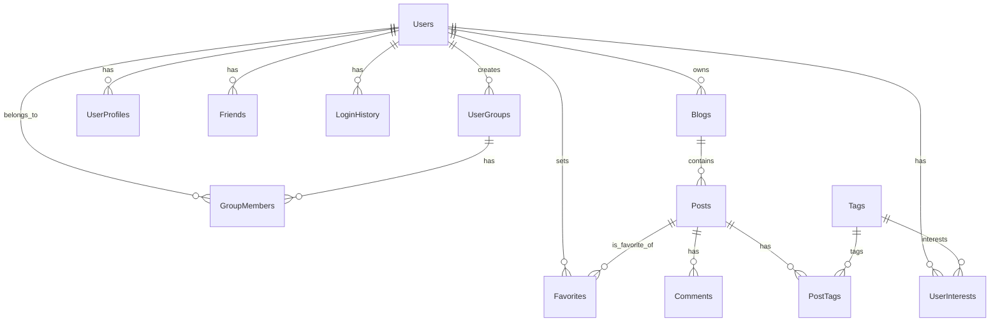

```mermaid

erDiagram
    Users ||--o{ Blogs : owns
    Users ||--o{ UserProfiles : has
    Users ||--o{ Favorites : sets
    Users ||--o{ Friends : has
    Users ||--o{ LoginHistory : has
    Users ||--o{ UserInterests : has
    Users ||--o{ UserGroups : creates
    Users ||--o{ GroupMembers : belongs_to
    Blogs ||--o{ Posts : contains
    Posts ||--o{ Favorites : is_favorite_of
    Posts ||--o{ Comments : has
    Posts ||--o{ PostTags : has
    Tags ||--o{ PostTags : tags
    Tags ||--o{ UserInterests : interests
    UserGroups ||--o{ GroupMembers : has

```
